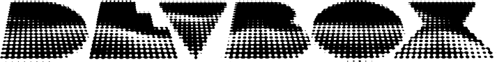

<p align="center">
  
</p>
<br/>

Minimal terminal setup for dev boxes. Rent a VM, pipe the script, work.

```bash
curl -fsSL https://cdn.dpuwork.com/setup.sh | bash
```

## what setup does

1. Installs base system packages: `git`, `curl`, `jq`, `openssh-client`, `build-essential`, `unzip`, `zsh`, `xclip`
2. Installs [gum](https://github.com/charmbracelet/gum), for the nice terminal prompts
3. Builds the latest tmux from source
4. Installs Docker Engine from the official Docker CE apt repo, enables the service, and adds your user to the `docker` group
5. Pulls in [Omadots](https://github.com/omacom-io/omadots) for dotfiles/config
6. Appends devbox's own tmux customizations on top of Omadots' config (pane-ID copy shortcut, status bar tag)
7. Installs dev tools and AI CLIs via [mise](https://mise.jdx.dev):
   - Terminal tools: `neovim`, `starship`, `eza`, `zoxide`, `fzf`, `gh`, `lazygit`, `lazydocker`, `btop`, `fastfetch`, `node`, `python`
   - AI CLIs & shims: `opencode`, `claude-code`, `codex`, `antigravity-cli`, [`tuicr`](https://github.com/agavra/tuicr)
8. Walks you through logging into git and GitHub, connecting to Tailscale with SSH, and naming your default tmux session (first run only — prompts default to `Work` for the session name, just hit enter to accept)
9. Turns on a firewall (ufw) that only allows SSH and Tailscale traffic, blocking everything else
10. Sets up your shell profile: `PATH`/mise activation, a `pbcopy` clipboard alias, a `tss` alias for `tailscale serve`, and auto-attaching tmux to your chosen session whenever you SSH in
11. Switches your default shell to zsh

Safe to run more than once — it skips anything already set up. Your tmux session name choice is remembered, so you won't be asked again on reruns.

## shortcuts

### omaterm shortcuts

The base tmux/Neovim (LazyVim) keybindings come from Omadots — see the full reference in the [Omaterm manual](https://learn.omacom.io/4/the-omaterm-manual/113/hotkeys).

### tmux shortcuts

| Hotkey     | Function                                                                              |
| ---------- | ------------------------------------------------------------------------------------- |
| `Prefix I` | Copy the current pane ID to the clipboard (via OSC 52, works through nested SSH/tmux) |

### aliases

| Alias    | Function                                                   |
| -------- | ---------------------------------------------------------- |
| `pbcopy` | Pipe stdin to the clipboard (`xclip -selection clipboard`) |
| `tss`    | Shortcut for `tailscale serve`                             |

## credits

The logo uses [Microwaves](https://billyargel.com/product/microwaves/) font by Billy Argel, free for personal use.
